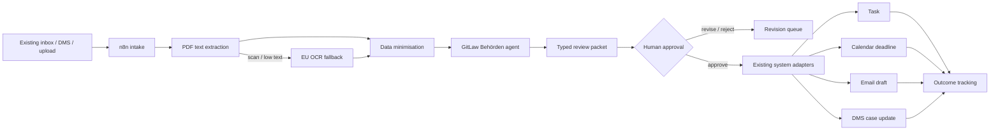

# Architecture

## Data boundaries

- **System of record:** customer's existing inbox/DMS/case system.
- **Orchestration:** n8n stores only the execution data required for the agreed
  retention period.
- **Reasoning:** GitLaw receives the minimum text needed for classification and
  drafting.
- **Approval:** the human sees the original and extracted fields together.
- **Write-back:** only approved, typed actions cross into production systems.

## Scaling path

For the first pilot, one n8n instance is enough. At higher volume, run n8n with
Postgres and queue workers, use Redis for execution dispatch, and move OCR to
background workers. Scaling should follow measured volume, not precede it.
